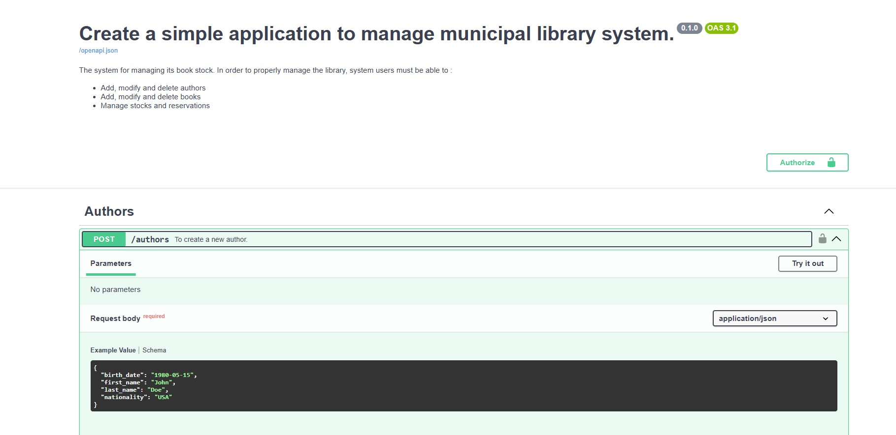
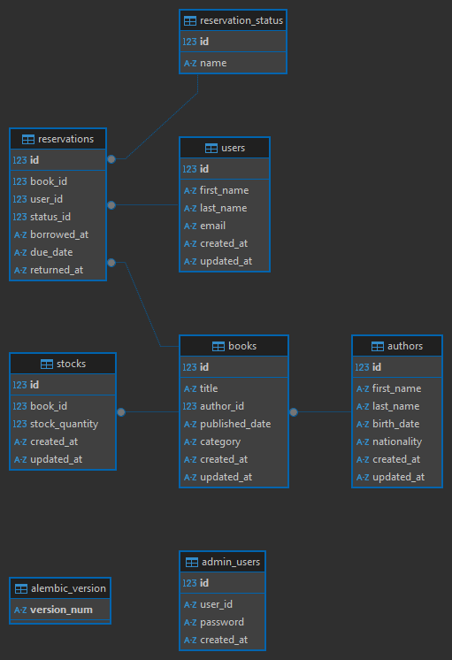

# Library system

Application to manage municipal library system

## Table of Contents
- [Features](#features)
- [Requirements](#requirements)
- [Installation](#installation)
- [Usage](#usage)
- [Tools](#Tools)
- [Tests](#tests)
- [Contact](#contact)


## Features

This application contains different endpoints and allows the user to use them, which is briefly explained below:

- **Add, modify and delete authors**
- **Add, modify and delete books**
- **Manage stocks and reservations**
- **FastAPI Doc**

- **Databases schema**



## Requirements

- **Python 3.12 or above**
- **Poetry** The app uses poetry to manage python dependencies. Make sure you have it on your machine or [install it](https://python-poetry.org/docs/#installation).

    ```shell
    $ poetry --version
    Poetry (version 1.8.2)
    ```    
- **FastApi**
- **SqlModel (ORM)**
- **Sqlite**     
- **uvicorn**
- **Alembic**


## Installation
Clone the repository:

```shell
$ git@github.com:krishnaraj-doureradje/library_system.git
$ cd library_system
```

Install dependencies
```shell
# To install both regular and development dependencies, run:
$ poetry install 

# Activate virtual environment
$ poetry shell

# Deactivate the virtual env
$ exit
```

## Usage
You can launch the application from your favorite IDE or CLI.
But there's one thing you should note.

- **Databases**: A lightweight Sqlite database (file) on your project root repository **library_system.db**
- **Tables** to store relevant information.


```shell
# From the project root directory
$ poetry shell

# It's best to add the project root directory to pythonpath
$ export PYTHONPATH=$PYTHONPATH:{pwd}

#  If it's first time please upgrade the database to the latest revision in Alembic
$ alembic upgrade head

# By default, the application log is in json format. If the developer wishes to make it human-readable, he must define the following environment variable 
$ export APP_LOG_FORMAT=apache

$ uvicorn src.main:app --host 0.0.0.0 --port 8090 --reload

# The application includes a Dockerfile, enabling us to easily 
# containerize the application and run it locally or in production using the docker run command.

$ docker build -t library_system:latest  .
$ docker run -d -p 8090:8090 library_system:latest
# If necessary, because when the developer builds the image, it already contains the sqlite database file.
$ docker exec -d <container-name-or-id> alembic upgrade head

# Health check
$ curl -X 'GET'   'http://localhost:8090/health'   -H 'accept: application/json' 
{"status":"ok"}

# All endpoints are secured by basic authentication. So you need a login and password to make a request.
$  curl -X 'GET'   'http://localhost:8090/authors?skip=0&limit=100'   -H 'accept: application/json'
{"detail":"Not authenticated"}
                                                                                                                                                                                                                                    
```

Once the application has been successfully launched, you can use Fasatpi's [Swagger Docs](http://127.0.0.1:8090/docs#/) to access the API documentation and use the endpoints.

[ReDocs](http://127.0.0.1:8090/redoc)

It will return a Json response with the appropriate status code.

- **200** Success response
- **201** Resource Created
- **204** Resource Deleted
- **400** BadRequest
- **401** Unauthorized
- **403** Forbidden
- **404** Item not found
- **422** Request validation Error
- **500** Internal Server Error

If you wish to consult the data contained in the database, you can use any database client to query it.

```sql
# For CLI queries, make sure you have sqlite3 client installed on your machine.
$ sqlite3 library_system.db

sqlite> .databases
main: /home/kdoureradje/workspace/01_personal/19_library_system/library_system/library_system.db r/w

sqlite> .tables
admin_users         authors             reservation_status  stocks            
alembic_version     books               reservations        users

sqlite> select * from authors;
1|John|Doe|1980-05-15|USA|2025-02-24 08:37:36|2025-02-24 08:37:36
2|Jane|Smith|1975-08-22|CAN|2025-02-24 08:37:36|2025-02-24 08:37:36
3|Albert|Einstein|1879-03-14|GER|2025-02-24 08:37:36|2025-02-24 08:37:36
4|Marie|Curie|1867-11-07|POL|2025-02-24 08:37:36|2025-02-24 08:37:36
5|Isaac|Newton|1642-01-04|ENG|2025-02-24 08:37:36|2025-02-24 08:37:36
6|Joddhn|Doe|1980-05-15|USA|2025-02-24 08:45:38|2025-02-24 08:45:38
```

If you've run into a problem, you'll want to run like you did the first time.

1. Stop the application by pressing ctrl + c
    
2. Remove Sqlite file
    ```shell
    $ rm library_system.db
    ```
3. Alembic migration
    ```shell
    $ alembic upgrade  head
    ```

4. Restart the application once again
    ```shell
    $ uvicorn src.main:app --host 0.0.0.0 --port 8090 --reload
    ```

## Tools
Two tools are installed in the project.
1. **Ruff** is a fast and configurable linter for Python that focuses on improving code quality and enforcing style guidelines. It supports several features, including linting, type checking, and fixing code style issue

    ```shell
    # To check the python files 
    $ ruff  check src/ tests/ --fix
      All checks passed!      

    # Format python files
    $ ruff format src/ tests/
    61 files left unchanged                           
    ```
    
2. **Mypy** is static type checker for Python that helps you catch type-related errors before you run your code.

    ```shell
    $ mypy src/ tests/ 
    Success: no issues found in 61 source files                                                                    
    ```

## Tests
I've added unit and integration test code to test the application's behavior, which is very useful for detecting bugs in the code before it goes into production.

> These tests use in-memory databases, so no files are created at runtime. At the end of the test, these DB are automatically deleted.

```shell
$ pytest tests     
======================================= test session starts ========================================
platform linux -- Python 3.12.9, pytest-8.3.4, pluggy-1.5.0
rootdir: /home/kdoureradje/workspace/01_personal/19_library_system/library_system/tests
configfile: pytest.ini
plugins: cov-6.0.0, anyio-4.8.0
collected 54 items                                                                                 

tests/integration/test_author.py ........                                                    [ 14%]
tests/integration/test_book.py ........                                                      [ 29%]
tests/integration/test_health.py .                                                           [ 31%]
tests/integration/test_stock.py ......                                                       [ 42%]
tests/integration/test_user.py ......                                                        [ 53%]
tests/integration/test_user_reservation.py .......                                           [ 66%]
tests/unit/test_pagination.py ..........                                                     [ 85%]
tests/unit/test_security.py ........                                                         [100%]

======================================== 54 passed in 0.71s ========================================


```

## Contact
If you have any questions, suggestions, or concerns, feel free to contact me at `krishna.radje@gmail.com`.
